# Usage

```
python gen.py
```

You may need to install the raleway found and the `poisson_disc` package.

# modify text.

Texts are in the two `data.yml` and `group.yaml`


#

 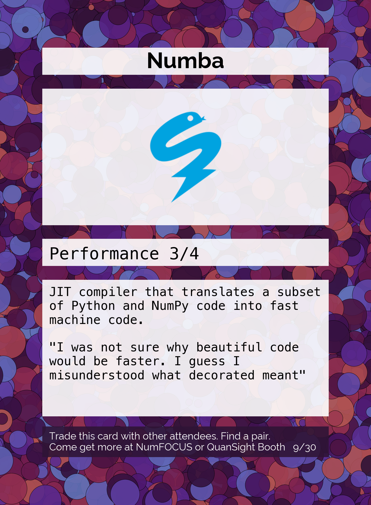 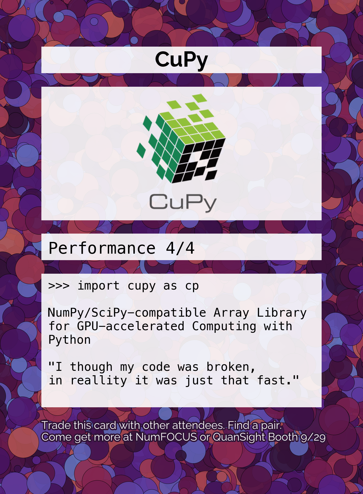  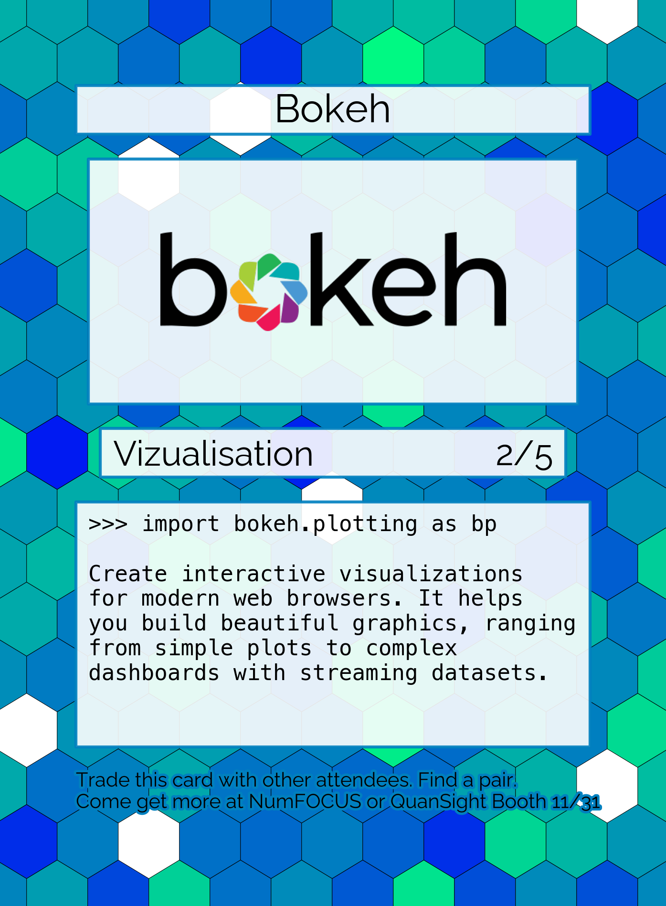 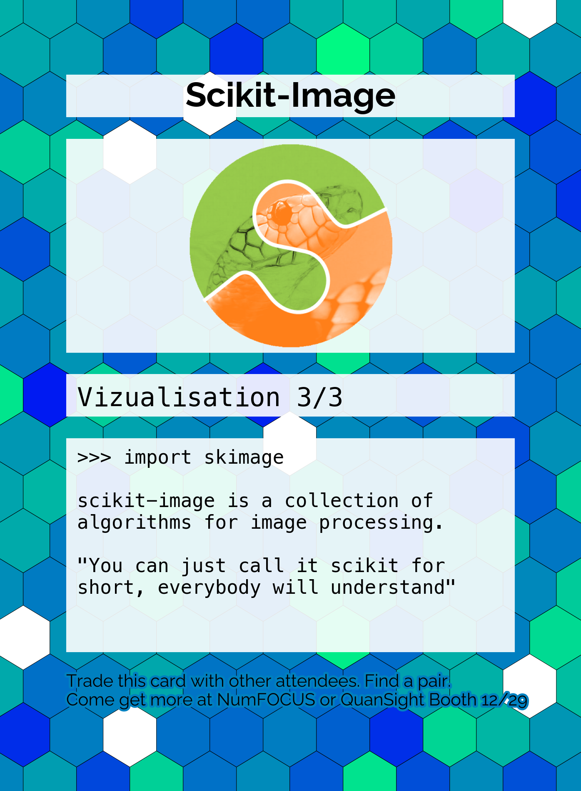 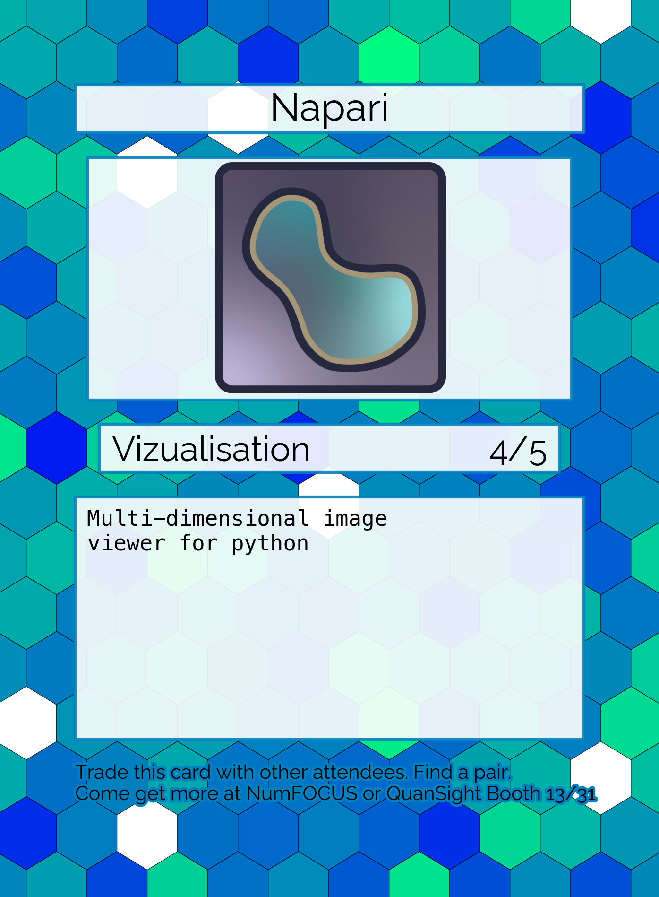 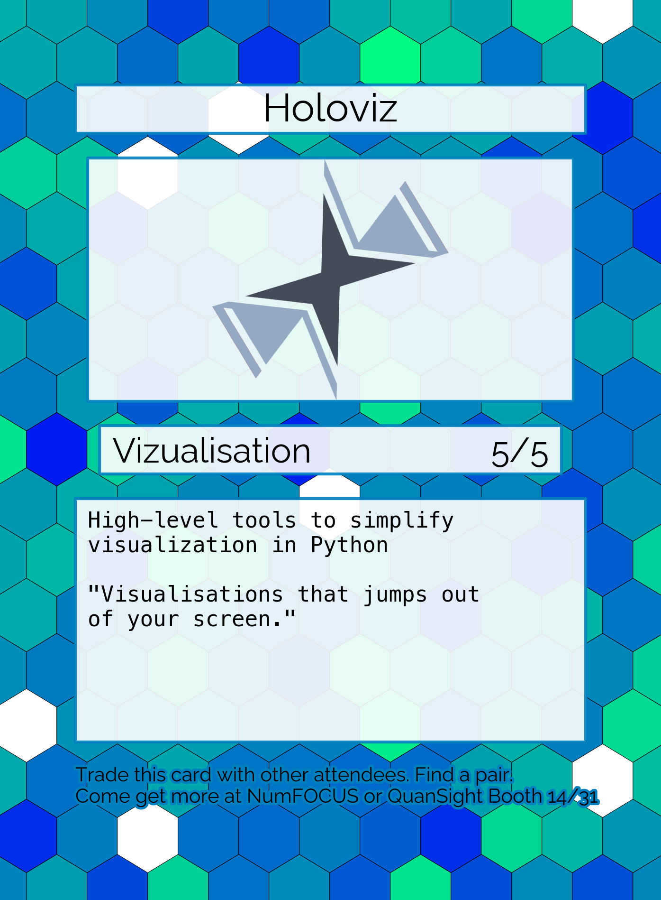 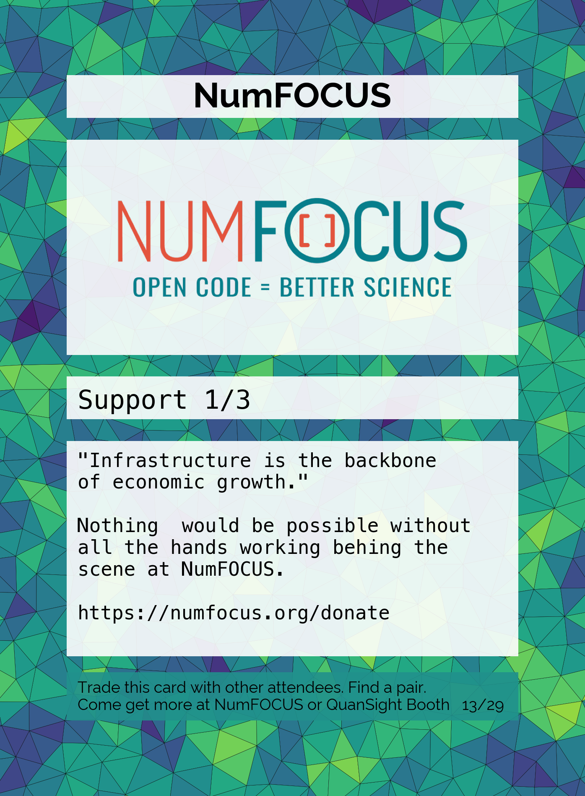    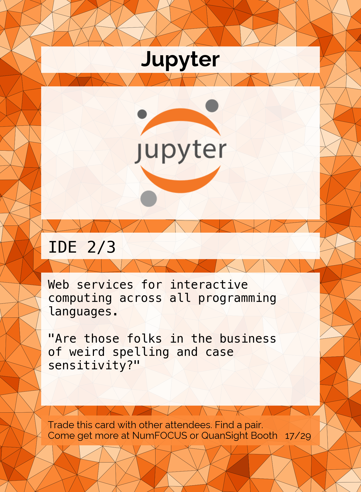 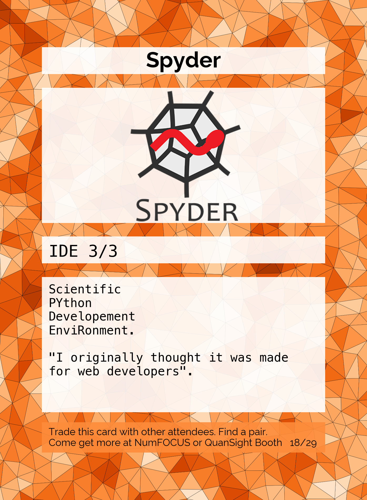 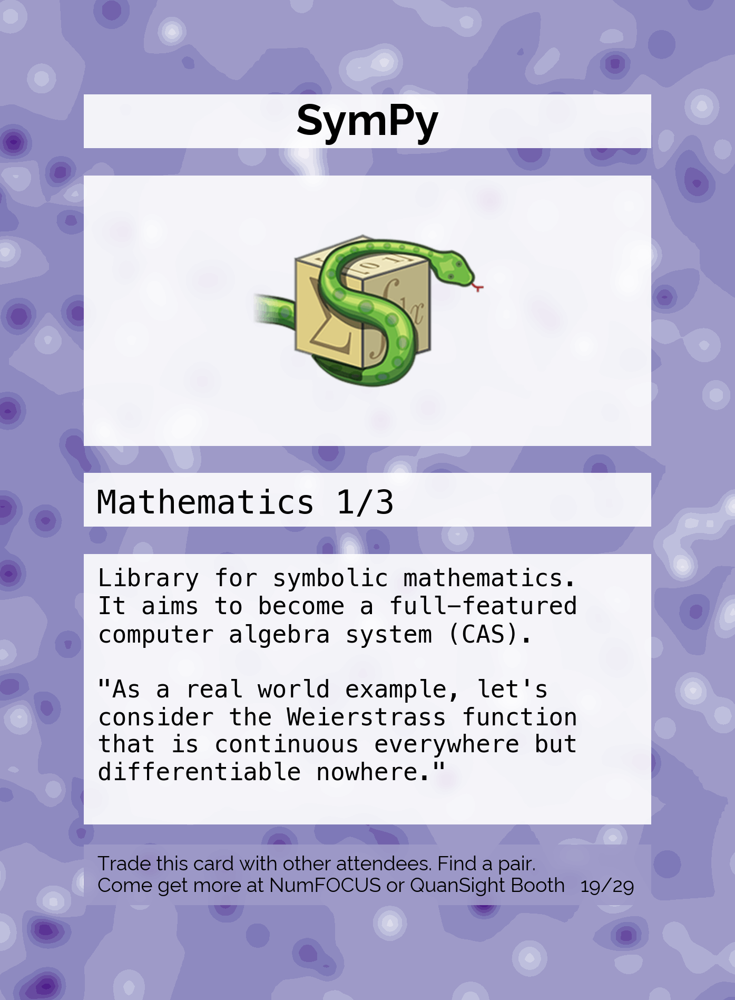 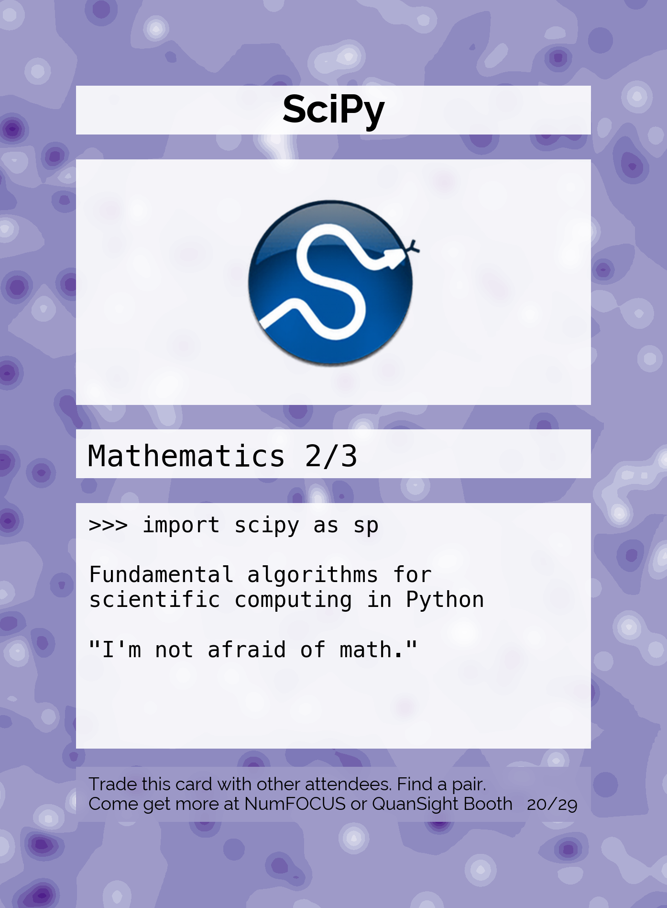 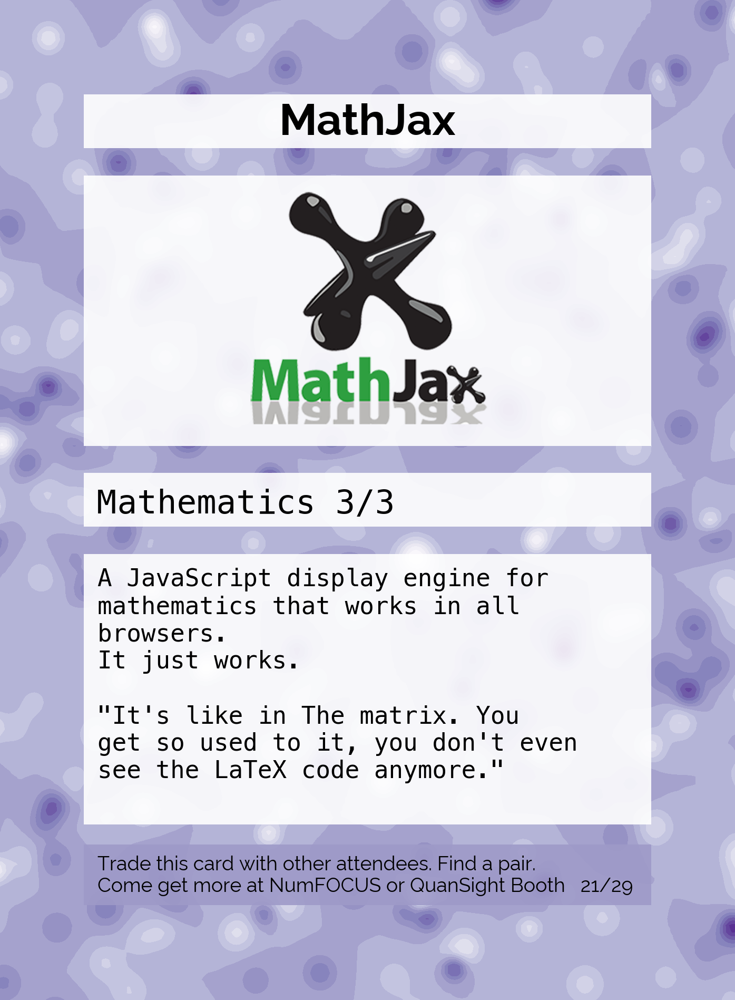       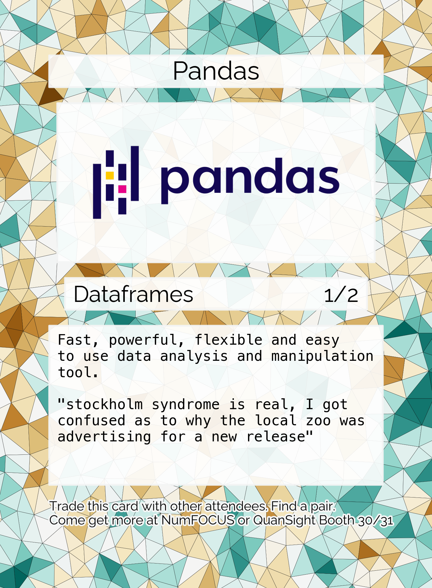 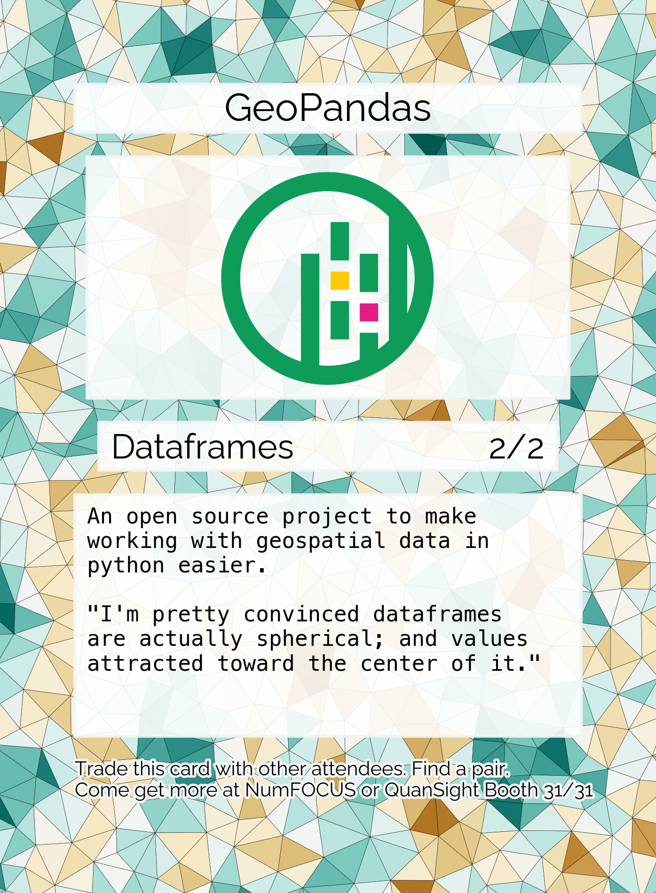
