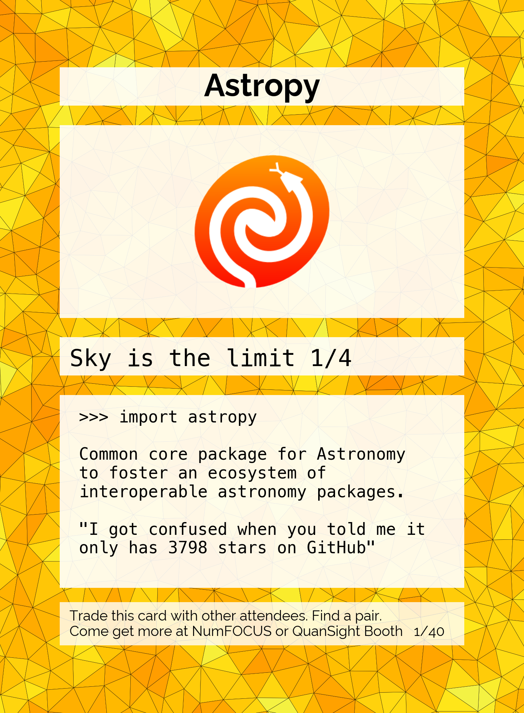
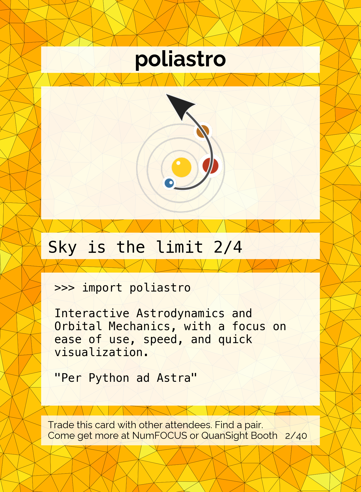

# 2022 archive.

To see the cards as distributed at Scipy 2022 see the 2022 tag.


# Usage

```
python gen.py
```

You may need to install the [Raleway font](https://fonts.google.com/specimen/Raleway) and the `poisson_disc`, `pyyaml`, and `matplotlib` packages.

# Modifying the Cards

Card texts are defined in `data.yml`, and color schemes are defined in `group.yaml`.


# Samples

                                     

## Suggested Backside Images


